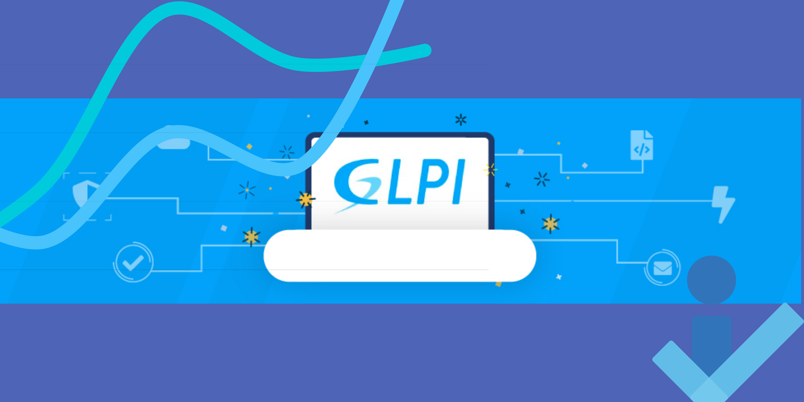

# 🛠️ GLPI Network Management and Security Guide

## 📊 Table des Matières

1. [Introduction](#1-introduction)  
2. [Contexte](#2-contexte)  
3. [Fonctionnalités de GLPI](#3-fonctionnalités-de-glpi)  
4. [Partie Pratique](#4-partie-pratique)  
   - [Création des statuts des matériels](#a-création-des-statuts-des-matériels)  
   - [Ajout de système d’exploitation](#c-ajout-de-système-dexploitation)  
   - [Création des Lieux et Salles](#e-création-des-lieux-et-des-salles)  
5. [Gestion des Utilisateurs](#5-gestion-des-utilisateurs-partie-2)  
6. [Configuration de l'annuaire LDAP](#6-configuration-de-lannuaire-ldap-dans-glpi)  
7. [Gestion des Tickets d’Incident](#18-gestion-des-tickets-dincident)  
8. [Gestion des Connexions Réseaux](#19-etudiant-partie-4-la-gestion-des-connexions-réseaux)  
9. [Gestion des Imprimantes](#20-etudiant-partie-5)  

---

## 💡 1. Introduction

La gestion du parc informatique est bien plus qu'un simple inventaire des équipements. Avec **GLPI** (Gestion Libre de Parc Informatique), vous pouvez :

- Suivre le cycle de vie des équipements et des logiciels.
- Gérer les utilisateurs et les incidents.
- Superviser les fournisseurs et le budget.
- Assurer la gestion de la sécurité et des tickets d'incident.

Ce guide fournit une approche pratique et détaillée pour configurer **GLPI** afin de simplifier ces processus.

---

## 💥 2. Contexte

L'utilisation de **GLPI** dans un environnement professionnel permet de centraliser et de structurer la gestion du parc informatique. Que ce soit pour la gestion des licences, des incidents ou des utilisateurs, **GLPI** facilite ces tâches essentielles.

---

## 🛡️ 3. Fonctionnalités de GLPI

- **Inventaire Matériel** : Ordinateurs, périphériques, équipements réseau.
- **Gestion Logicielle** : Licences, installations, versions.
- **Gestion des Consommables** : Cartouches d'imprimantes, accessoires.
- **Suivi des Tickets d'Incident** : Création, assignation, résolution.
- **Gestion des Fournisseurs et Budgets**.
- **Configuration LDAP et Réseaux**.

---

## 🎨 4. Partie Pratique

### a) Création des Statuts des Matériels

1. Allez dans **Configuration > Statuts**.
2. Créez des statuts personnalisés pour chaque type de matériel.

### c) Ajout de Système d’Exploitation

1. Rendez-vous dans **Inventaire > Systèmes d’Exploitation**.
2. Ajoutez les OS utilisés dans votre parc.

### e) Création des Lieux et des Salles

1. Allez dans **Administration > Lieux**.
2. Ajoutez les bâtiments et les salles.

---

## 👥 5. Gestion des Utilisateurs (Partie 2)

- Synchronisez vos utilisateurs via **LDAP**.
- Définissez les rôles et permissions pour chaque utilisateur.

---

## 🔧 6. Configuration de l'Annuaire LDAP

1. Accédez à **Configuration > Authentification > LDAP**.
2. Renseignez les informations de votre serveur LDAP.

---

## 🛡️ 18. Gestion des Tickets d’Incident

1. Accédez à **Assistance > Tickets**.
2. Créez des tickets, assignez-les et suivez leur progression.

---

## 🛢️ 19. Gestion des Connexions Réseaux

- Configurez les commutateurs, les câbles Ethernet et les vidéoprojecteurs.

---

## 💻 20. Gestion des Imprimantes

- Ajoutez et configurez vos imprimantes dans **GLPI**.
- Gérez les cartouches et consommables associés.

---

## 📦 Resources

- **Site Officiel de GLPI** : [GLPI Project](https://glpi-project.org)  
- **Documentation Officielle** : [GLPI Docs](https://glpi-docs.readthedocs.io)

---

### 📅 Auteur

**Eloham Caron**  
13 Décembre 2024
